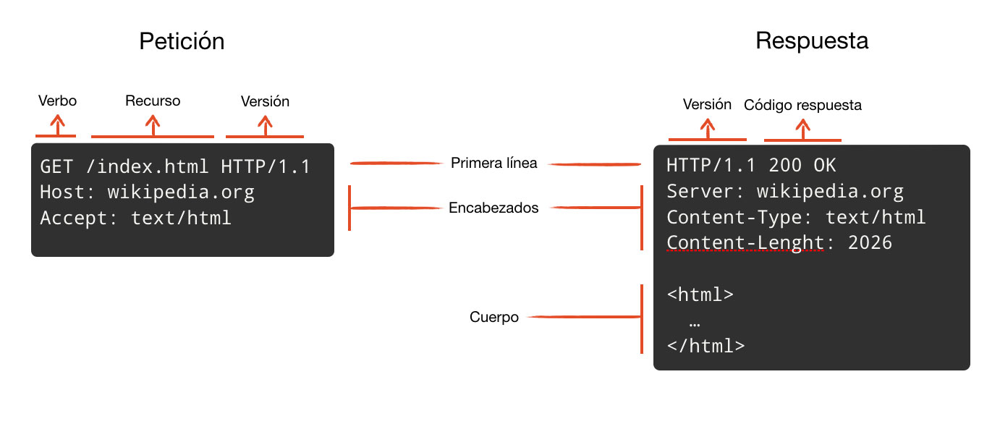
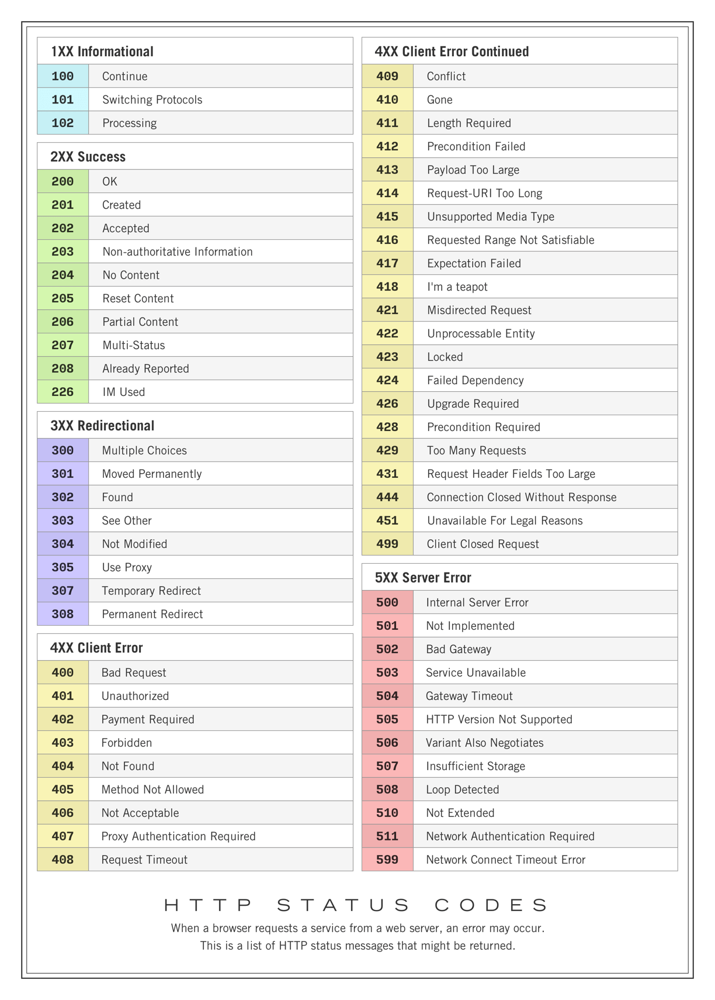

# API REST

## Definiciòn de API:
- Interfaz de Programacion de Aplicaciones: Nos permite interactuar con un software; Conjunto de Subrutinas, procesos, funciones o mètodos que ofrece un software para interactuar con otro SW
- API rest: permite crear app web o movile que se conecte a un servidor via cliente - servidor. REst utiliza este protocolo

## Protocolo HTTP
-  (Protocolo de transferencia de Hipertextos). 
- Es un stàndar para que todos hablemos (cliente, servidor) el mismo idioma y cumplir las mismas reglas.
- Se basa en una comunicaciòn cliente -servidor, el cliente hace un peticiòn y el servidor emite una respuesta.

## Mètodos/Verbos HTTP

- identifican que tipo de peticiòn està haciendo el cliente hacia el servidor.

### GET:
- peticiòn para obtener informaciòn por parte del cliente / envìo informaciòn por parte del servidor.

### POST:
- peticiòn que sirve para enviar informacion del cliente hacia el servidor / creamos nuevos recursos.

### PUT:
- peticiòn que sirve para actualizar un recurso.

### DELETE:
. peticion que sirve para eliminiar recurso.

### PATCH:
- peticion que sirve para actualizar una parte(pedazo) del recurso.

### HEADER:
- peticiòn que sirve para consulta la existencia de un recurso.

### OPTIONS:
- peticion que sirve para verificar si el dominio a consultar es permitido, ejem: cors

## Còdigos de Respuesta
 Indican si se ha completado satisfactoriamente uns solicitud HTTP especìfica.

- 100 a 199: Informativos.
- 200 a 299: Correctos.
- 300 a 399: Redirecciòn.
- 400 a 499: Error del Cliente.
- 500 a 599: Error de Servidor.

## REST y sus Propiedades.

## QUe es URI y URL

